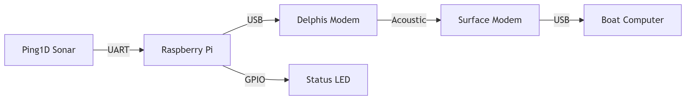

# 🌊 AquaPing - Underwater Altimeter Telemetry & Visualization 

<p align="center">
  
  
  
</p>

**AquaPing** is a modular, field-deployable **underwater altimeter telemetry system** that transmits real-time depth measurements using a Ping1D sonar and Delphis acoustic modem to a surface receiver (e.g., a boat). Designed for **marine research, seabed profiling, and underwater robotics**, AquaPing combines robust hardware and Python-based control software for both ends of the communication link.

**AquaPing** is a complete underwater telemetry and visualization platform featuring:

- 🔽 **Real-time depth acquisition** using a Ping1D sonar
- 🌊 **Underwater acoustic transmission** to surface using Delphis modem
- 📈 **Live PC interface** (PyQt5 GUI) to visualize and record altimeter data with ascent/descent speed estimation & GPS tagging


---

## ✨ Key Features

| 🎯 Depth Accuracy | 📡 Acoustic Link | 🔁 Retry Handling | 🖼️ Real-time Plot | ⏱️ Speed Tracking | 🧩 Modular Design |
|------------------|------------------|-------------------|------------------|-------------------|------------------|
| Ping1D sonar for precise altimetry | Delphis modem for data uplink | LED-coded error retry & auto reconnect | PyQt5 live plot with zoom | Instantaneous & average speed (m/min) | 3D-printed Support, open-source software |

---

## 🔧 Project Structure
## 🧪 Repository Structure

```text
AquaPing/
├── transmitter/              # Raspberry Pi underwater unit
│   └── echo_altimeter.py     # Main altimeter control script
│
├── receiver/                 # Boat-side PC GUI application
│   ├── receive_data_v1/v2.py # Data reception and processing
│   └── requirements.txt      # GUI dependencies
│
├── 3d_models/                # Printable hardware components
│   └── battery_housing.stl   # Electronics enclosure
│
├── docs/                     # Documentation resources
│   ├── wiring_diagram.png    # Full connection schematic
│   ├── system_diagram.png    # Architecture overview
│   ├── photos/               # Hardware images
│   │   ├── unit_assembled.jpg
│   │   ├── internals.jpg
│   │   └── deployment.jpg
│   ├── datasheets/           # Technical specifications
│   │   ├── ping1d.pdf
│   │   └── delphis_m25.pdf
│   └── ui_screenshot.png     # GUI preview
│
├── LICENSE                   # MIT License
└── README.md                 # This documentation

```




---

## 🧰 Hardware Components

| Component           | Description                                      |
|---------------------|--------------------------------------------------|
| 🎯 Ping1D           | Altimeter sonar sensor from Blue Robotics        |
| 🧠 Raspberry Pi     | Pi Zero / 3 / 4 for control & processing          |
| 🔊 Delphis Modem    | Underwater acoustic modem for data transmission  |
| 🔋 Power Supply     | 8.4V Battery(2S) with 5V Regulator                     |
| 💡 LED Indicator    | GPIO-controlled LED for transmission feedback    |
| 🖨️ 3D-Printed Parts | Enclosure, brackets, mounts           |

---

## ⚡ Wiring Diagram

> 📌 Full-size diagram in [`docs/wiring_diagram.png`](docs/wiring_diagram.png)

| Device             | Pi Connection        |
|--------------------|----------------------|
| Ping1D TX →        | GPIO 15 (UART RX)    |
| Ping1D RX →        | GPIO 14 (UART TX)    |
| Status LED →       | GPIO 12              |
| Delphis Modem      | USB Serial           |
| Power Supply       | 8.4V → Regulated 5V   |


---

## 📸 Equipment Photos

| Altimeter | Modem | Assembled Unit |
|-----------|-------|----------------|
|  |  |  |

More in [`docs/photos`](docs/photos)

---

```

## ✨ Key Features
| Feature | Description |
|---------|-------------|
| 🎯 Depth Accuracy | ±1cm up to 100m range |
| 📶 Transmission | 0-300m depth   |
| 🔋 Power | 5V DC, ~1W average consumption |
| 🛠️ Enclosure | Acrylic enclosure waterproof housing |
| 📊 Data Output | CSV, JSON, and terminal display |


### ⚡ Wiring Guide
```python
Ping1D (UART) ↔ Raspberry Pi:
    TX -> GPIO 15 (RX)
    RX -> GPIO 14 (TX)
    GND -> GND

Delphis Modem ↔ Raspberry Pi:
    USB-A ↔ USB Micro-B

Status LED:
    + -> GPIO 12
    - -> GND
```

## 📸 Hardware Photos
<div align="center">
  
   
  
</div>

## 🛠️ Software Installation
### Transmitter (Underwater Unit)
```bash
# Install dependencies
sudo apt update
sudo apt install python3-pip python3-serial
pip3 install brping pyserial

# Enable UART
sudo raspi-config nonint do_serial 0
sudo reboot
```

### Receiver (Surface Unit)
```bash
pip3 install pyserial matplotlib  # For basic plotting
```


🔁 Auto-start on Boot
Use a systemd service. Save the following to /etc/systemd/system/aquaping.service:

ini
Copy
Edit
[Unit]
Description=AquaPing Altimeter Service
After=network.target

[Service]
ExecStart=/usr/bin/python3 /home/pi/AquaPing/transmitter/echo_altimeter.py
Restart=always
RestartSec=20
User=pi
WorkingDirectory=/home/pi/AquaPing/transmitter

[Install]
WantedBy=multi-user.target
Then run:

bash
Copy
Edit
sudo systemctl daemon-reload
sudo systemctl enable aquaping.service
sudo systemctl start aquaping.service
📥 Receiver (Boat)
Connect Delphis modem via USB and run:

bash
Copy
Edit
cd receiver
python3 receive_data.py
Expected output:

yaml
Copy
Edit
Received: $U001082,92
Depth: 0.82 m | Confidence: 92%


---


## 📌 Quick Start
```bash
# Transmitter (RPi underwater unit)
cd sonar && python3 echo_altimeter.py

# Receiver (Boat computer)
python3 receive_data_v1.py/receive_data_v2.py

## 🚀 Deployment Guide
1. Assemble hardware in waterproof enclosure
2. Power up transmitter unit
3. Deploy in water (ensure antennas are vertical)
4. Start receiver software on boat computer
5. Monitor depth readings in real-time

Sample Output:
```
[2023-11-15 14:30:45] Depth: 12.34m | Confidence: 95%


## 📊 Data Format
Transmitted packets use compact binary format:
```
Header (2B) | Depth (4B) | Confidence (1B) | Checksum (1B)
```

## 🖨️ 3D Printing Guide
| Part | Material | Print Settings |
|------|----------|----------------|
| Main Housing | PETG | 0.2mm layer, 4 walls |
| Sonar Mount | ASA | 100% infill |
| Modem Bracket | PLA+ | Supports enabled |

## ⚠️ Troubleshooting
| Issue | Solution |
|-------|----------|
| No depth readings | Check UART connections |
| Failed transmissions | Verify modem dip switches |
| High noise | Increase distance from propellers |

## 📚 Documentation
- [Ping1D Manual](docs/datasheets/ping1d.pdf)
- [Delphis Modem Specs](docs/datasheets/delphis.pdf)
- [System Schematic](docs/system_diagram.png)


## 📜 License
MIT License - See [LICENSE](LICENSE) for details.

## 👨‍💻  Maintainer
**Muhammed Nabeel**  
Research Engineer  
Mubadala Arabian Center for Climate and Environmental ScienceS (ACCESS)   
📍 NYU Abu Dhabi
📧 mnm9857@nyu.edu  

<div align="center">
  
  
</div>
